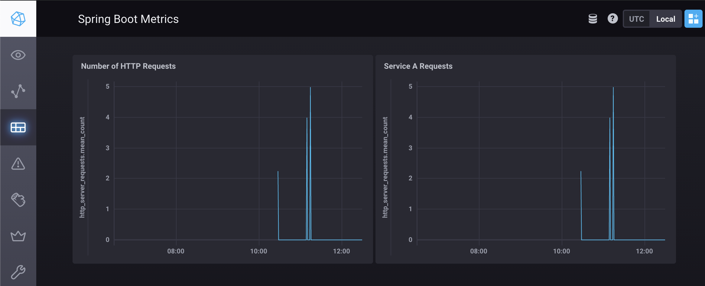
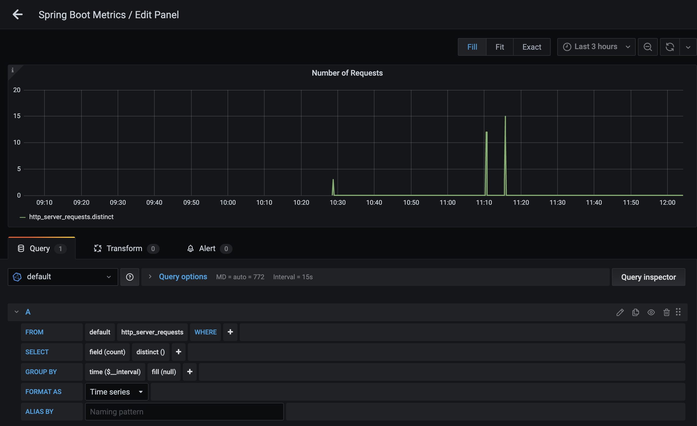
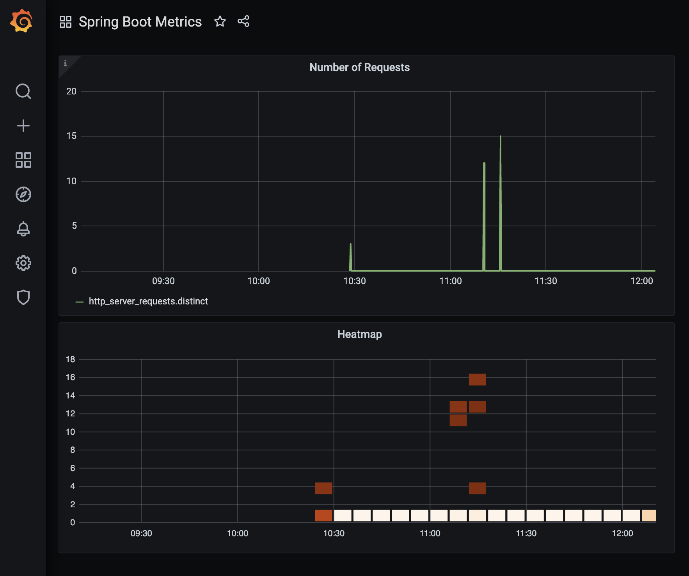

# SpringCloudTelemetry

A repository showing Spring Cloud capabilities for Cloud Telemetry.

   * [Building the Project](#building-the-project)
   * [Running the Project](#running-the-project)
   * [Tracing](#tracing)
   * [Metrics](#metrics)
      * [Inspecting Influx DB](#inspecting-influx-db)
      * [Using Chronograf &amp; Grafana](#using-chronograf--grafana)
         * [Chronograf](#chronograf)
         * [Grafana](#grafana)
   * [Spring Boot Configurations](#spring-boot-configurations)
      * [... for Tracing](#-for-tracing)
      * [... for Metrics](#-for-metrics)
   * [References](#references)

The repository includes:

* Tracing - using [Spring Cloud Sleuth](https://spring.io/projects/spring-cloud-sleuth) and [Zipkin.io](https://zipkin.io/), but other backends (like Jaeger) are possible, too.
* Metrics - using [Micrometer.io](https://micrometer.io/docs) and [InfluxDB](https://www.influxdata.com/) ass metrics backend.
* Distributed Logs - using a distributed logs backend.

The project setup comprises 3 simple Spring Boot services that each expose a MongoDB datastore using Spring Data REST. Thus, they provide a REST API to read and write data from and to MongoDB.

A script is used to send data in JSON format to `service-a`, which persists the data in its own store and then calls `service-b` to replicate the data in its store. `Service-b` then calls `service-c` to do the same.

Thus, a chain of requests is created that demonstrates tracing. Also logs are created and metrics are gathered, which will be stored in an [InfluxDB](https://www.influxdata.com/) and displayed using [Chronograf](https://www.influxdata.com/time-series-platform/chronograf/) and [Grafana](https://grafana.com/).

# Building the Project

At the root of the project, from a terminal execute:

1. `mvn clean package`

# Running the Project

To run the project, you need to start a few services using Docker first. Make sure your Docker daemon is up and running before executing the following scripts:

From the project root, execute:
1. `./scripts/startMongoDb.sh` - starts a local MongoDB image and an image of Mongo Express, a browser-based admin UI available under [http://localhost:8081](http://localhost:8081).
2. `./scripts/startZipkin.sh` - starts Zipkin tracing server locally on [http://localhost:9411](http://localhost:9411)
3. `./scripts/startInfluxGrafana.sh` - starts InfluxDB, Chronograf (its admin and dashboard UI) and Grafana (for more dashboards). InfluxDB will be the sink of metrics information gathered by Spring Boot via [Micrometer.io](https://micrometer.io/docs).  
   Once up and running, InfluxDB is available on [http://localhost:8086](http://localhost:8086) or `http://influxdb:8086` from within the Docker network.  
   Chronograf will be available at [http://localhost:8888](http://localhost:8888).  
   Grafana will be available at [http://localhost:3000](http://localhost:3000).

Since this project uses 3 services that communicate with each other, it is best to run each of the commands below from a separate terminal.

1. `mvn -f ./sample-service-a/pom.xml spring-boot:run` 
2. `mvn -f ./sample-service-b/pom.xml spring-boot:run` 
3. `mvn -f ./sample-service-c/pom.xml spring-boot:run` 

Once up and running, you can simulate network traffic between the services and see tracing, logs and metrics being emitted.
# Tracing

With the services and Docker images up and running, let's create some data.

All 3 services provide an API to persist and read a `Person` object.
We have provided a shell script that sends a simple REST request to create a `Person` object to `service-a`.
The person will be propagated (replicated) into `service-b` from where it will be propagated to `service-c`:

```shell
./scripts/createPerson.sh
```

As a result, you will see the following:
1. Log output is generated in all 3 services indicating that the request was received, the `Person` persisted and replicated on to the next service.
2. If you log on to your [local Mongo Express](http://localhost:8081/db/test/) in the `test` database you will see 3 collections have been created. Each one is holding the `Person` representation of its respective service.
3. If you log on to your [local Zipkin](http://localhost:9411) instance, you will be able to see the traces. All you need to do is press the *Run  Query* button, and you will see traces of requests between the services. Click on any of them, to drill down deeper!

Furthermore, you will be able to see metrics, which is explained in the next section.

# Metrics

With the services and Docker images up and running, let's create more data.

```shell
./scripts/createPerson.sh
./scripts/createPerson.sh
./scripts/createPerson.sh
./scripts/createPerson.sh
```

This will generate 12 REST request and 12 `Person` instances being created (never mind that their names are duplicates).

## Inspecting Influx DB

Let's look at our InfluxDB to see, if the metrics arrived:

```shell
# Lists your docker containers. There should be one
# named something like 'scripts_influxdb_1'. Copy that
# name. 
docker container ls 

# Start the 'influx' command inside the InfluxDB
# container to get access to the command line.
docker exec -it scripts_influxdb_1 influx

# List the databases
show databases
```

As a result, you should see:

```shell
name: databases
name
----
db0
_internal
spring-boot-metrics
```

Note the `spring-boot-metrics` database. That was generated by the Spring Boot services (see [Spring Boot Configurations](#spring-boot-configurations) below).

Go ahead and type the following:

```shell
use spring-boot-metrics
show measurements
```

As a result you will see a list of measurements sent by the Spring Boot services, each containing time series that can be nicely plotted using Chronograf or Grafana.

Have a look at the measurement types! The include JVM statistics (e.g. classes loaded), system statistics (e.g. CPU usage), but also application statistics (e.g. `http_server_requests`)!

You can add your own measurements, if you like. An example that describes how to do that can be found [here](https://www.mokkapps.de/blog/monitoring-spring-boot-application-with-micrometer-prometheus-and-grafana-using-custom-metrics/) and [here](https://www.baeldung.com/micrometer). More information on Micrometer integration into Spring Boot can be found [here](https://spring.io/blog/2018/03/16/micrometer-spring-boot-2-s-new-application-metrics-collector).

Looking at a database is not fun, so let's look at Chronograf & Grafana instead to plot the timeseries in a human-consumable fashion.
## Using Chronograf & Grafana

### Chronograf

Chronograf is InfluxDB's admin UI, but it also includes dashboard capabilities. Grafana is an open dashboarding solution which not only works with InfluxDB but many other solutions, too.

To use Chronograf, proceed as follows:

1. Open your browser and point it to [http://localhost:8888/](http://localhost:8888/)
2. A connection to InfluxDB is already configured (see the *Configuration* menu entry on the left).
3. Click on the *Dashboards* menu entry on the left 
4. Click on *Create Dashboard* followed by *Add Data*
5. In the opening dialog window, in the top left, you can specify a name the chart you are about to create.  
   A chart is simply plot of query that gets periodically issued against InfluxDB with a certain cadence.  
   Let's call it *Number of HTTP Requests*
6. Add the lower half of the window find the *spring-boot-metrics.autogen* database and click on it. You will again see the list of measurements.
7. Expand the *http_server_requests* measurement and on the right (in the *Fields* column) select the *count* checkbox. This will generate a query statement and execute it immediately.
8. Save the chart, by clicking the small, green confirmation button on the top right.
9. Now, find the button near the top right with the *Pause* icon ( `||` ), expand its dropdown and select 10s.
   This enables the periodic query execution and will lead to the chart updating automatically every 10s.

As a result your query should look like this:


Now, execute the following on the command line again:

```shell
./scripts/createPerson.sh
./scripts/createPerson.sh
./scripts/createPerson.sh
./scripts/createPerson.sh
```

It will take approx. 20s until you will see the chart displaying a spike! What you see is the number of requests that just came in. 



Go ahead, create more charts, plot different metrics and create and save your own dashboards.
It's all there - made possible for you by Spring Boot.

### Grafana

Grafana is an open dashboard solution that not only works with InfluxDB but a variety of other timeseries databases, e.g. Prometheus.

You can access Grafana using your browser. To set up a dashboard proceed as follows:

1. Open your browser and point it to [http://localhost:3000](http://localhost:3000).
2. When asked to login, use user: `admin`, password: `admin` to log on.
3. You will be asked to change your password, just skip that step.
4. A data source pointing to InfluxDB and the `spring-boot-metrics` database is already set up.
   You can see it in the *Configurations > Data Sources* menu on the left.
5. Create a dashboard from the menu on the left by hitting the `+` entry and selecting *Dashboard*.
6. Click on *Add new panel*
7. In the opening dialog window, find the query editor at the lower half of the window. In it click the *select measurement* button and choose *http_server_requests*.
8. Find the *field(value)* button in the row for the `SELECT` statement, click it and select *count*.
9. Find the *mean()* button next to it, click it and select *Remove* (we don't want the mean count of requests but the actual count values)
10. Click on the `+` button where the *mean()* button used to be, and select *Aggregtations > distinct*.
11. Finally, click the *Apply* button at the top right of the window.

As a result, the query should look like this:



As a result you will see a dashboard with your plot of requests.

Again, you can generate a few requests like that:

```shell
./scripts/createPerson.sh
./scripts/createPerson.sh
./scripts/createPerson.sh
./scripts/createPerson.sh
```

And see how the chart updates.



# Spring Boot Configurations
## ... for Tracing

For tracing, all you need is the following dependencies in your `pom.xml`:

```xml
<!-- Spring Cloud Sleuth library used by Spring Boot to trace. -->
<dependency>
  <groupId>org.springframework.cloud</groupId>
  <artifactId>spring-cloud-starter-sleuth</artifactId>
</dependency>

<!-- Spring Cloud Starter for Zipkin as the tracing backend. -->
<dependency>
  <groupId>org.springframework.cloud</groupId>
  <artifactId>spring-cloud-starter-zipkin</artifactId>
</dependency>
```

Then in your `application.yaml`, you need to configure the tracing sample rate:

```yaml
spring:
  cloud:
    # Tracing configuations:
    # Sampler probability should be between 0.0 and 1.0. 
    # 0.1 is the default, meaning that 10% of requests are 
    # actually traced. The rest is not, for performance reasons.
    sleuth:
      sampler:
        probability: 0.1 # set this to 1.0 only for testing / debugging!
```
Using the `spring.clound.sleuth` configurations you can also specify the URI for the Zipkin or other tracing backends.
## ... for Metrics

For metrics, all you need is the following dependencies in your `pom.xml`:

```xml
<!-- The Micrometer core library that Spring Boot uses to create metrics -->
<dependency>
  <groupId>io.micrometer</groupId>
  <artifactId>micrometer-core</artifactId>
</dependency>

<!-- The Micrometer integration library for InfluxDB as a backend. -->
<dependency>
  <groupId>io.micrometer</groupId>
  <artifactId>micrometer-registry-influx</artifactId>
</dependency>
```

Then in your `application.yaml`, you need to configure the tracing sample rate:

```yaml
management:
  metrics:
    tags:
      service: ${spring.application.name}
    export:
      influx:
        auto-create-db: true
        db: spring-boot-metrics
        uri: http://localhost:8086
        step: 20s
        user-name: admin
        password: admin
```
This configures the Spring Boot actuator framework to export metrics to InfluxDB (using the Micrometer InfluxDb integration). It instructs Spring Boot to auto-create a database in InfluxDb named `spring-boot-metrics` and the URI where InfluxDB is running. 

The `step` property is used to tell Spring Boot in which interval new metrics information should be uploaded to InfluxDB. Valid values are `5s`, `5m`, `5d` (for seconds, minutes, days).

The `username` and `password` are the credentials used to authenticate to InfluxDB.

Also note the `management.metrics.tags` property map. Here you can define additional tags that will be added to the metrics that are being produced. In our case, we add a `service` tag which holds the name of the service (Spring Boot application name) that created the metrics. That allows us to filter in Chronograf or Grafana by the service instances. 

There are many more settings that are noteworthy. For details, please consult the [Actuator Metrics documeentation](https://docs.spring.io/spring-boot/docs/current/reference/html/production-ready-features.html#production-ready-metrics)
# References

* [Micrometer: Spring Boot 2's new application metrics collector](https://spring.io/blog/2018/03/16/micrometer-spring-boot-2-s-new-application-metrics-collector)
* [Influx DB, Chronograf and Grafana using Docker Compose](https://github.com/jkehres/docker-compose-influxdb-grafana)
* [Spring Boot Metrics with Influx DB](https://medium.com/@rohansaraf/monitoring-in-springboot-2-0-micrometer-influxdb-chronograf-d049698bfa33)
* [Monitoring Spring Boot Application With Micrometer, Prometheus And Grafana Using Custom Metrics](https://www.mokkapps.de/blog/monitoring-spring-boot-application-with-micrometer-prometheus-and-grafana-using-custom-metrics/)
* [A quick guide to micrometer](https://www.baeldung.com/micrometer)
* [Spring Boot Actuator - Metrics](https://docs.spring.io/spring-boot/docs/current/reference/html/production-ready-features.html#production-ready-metrics)