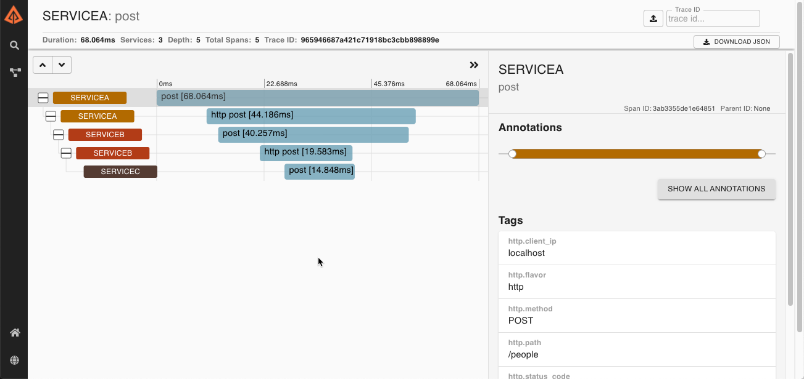
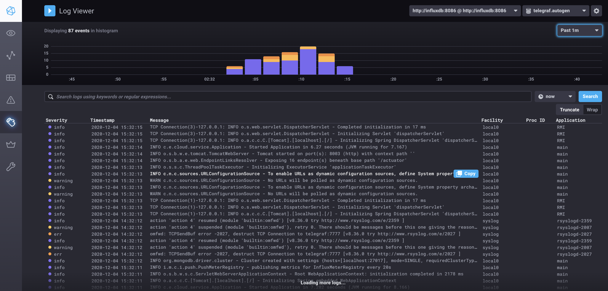
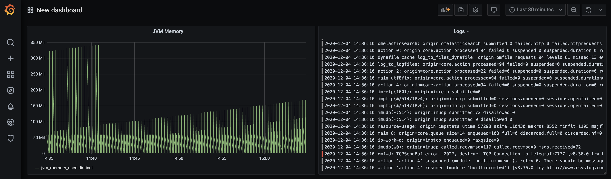

# Spring Cloud Telemetry

A repository showing Spring Cloud capabilities for Cloud Telemetry.

   * [Building the Project](#building-the-project)
   * [Running the Project](#running-the-project)
   * [Tracing](#tracing)
   * [Metrics](#metrics)
   * [Distributed Logs](#distributed-logs)
   * [Inspecting Influx DB](#inspecting-influx-db)
   * [Using Chronograf &amp; Grafana](#using-chronograf--grafana)
      * [Chronograf](#chronograf)
      * [Grafana](#grafana)
   * [Spring Boot Configurations](#spring-boot-configurations)
      * [... for Tracing](#-for-tracing)
      * [... for Metrics](#-for-metrics)
      * [... for Distributed Logging](#-for-distributed-logging)
      * [Context-Enhanced Log Messages](#context-enhanced-log-messages)
   * [Appendix A: rsyslog &amp; telegraf configurations](#appendix-a-rsyslog--telegraf-configurations)
      * [Rsyslog Docker Configurations](#rsyslog-docker-configurations)
      * [Telegraf Docker Configurations](#telegraf-docker-configurations)
   * [References](#references)

The repository includes:

* Tracing - using [Spring Cloud Sleuth](https://spring.io/projects/spring-cloud-sleuth) and [Zipkin.io](https://zipkin.io/), but other backends (like Jaeger) are possible, too.
* Metrics - using [Micrometer.io](https://micrometer.io/docs) and [InfluxDB](https://www.influxdata.com/) ass metrics backend.
* Distributed Logs - using a distributed logs backend.

The project setup comprises 3 simple Spring Boot services that each expose a MongoDB datastore using Spring Data REST. Thus, they provide a REST API to read and write data from and to MongoDB.

A script is used to send data in JSON format to `service-a`, which persists the data in its own store and then calls `service-b` to replicate the data in its store. `Service-b` then calls `service-c` to do the same.

Thus, a chain of requests is created that demonstrates tracing. Also logs are created and metrics are gathered, which will be stored in an [InfluxDB](https://www.influxdata.com/) and displayed using [Chronograf](https://www.influxdata.com/time-series-platform/chronograf/) and [Grafana](https://grafana.com/).

# Building the Project

At the root of the project, from a terminal execute:

1. `mvn clean package`

# Running the Project

To run the project, you need to start a few services using Docker first. Make sure your Docker daemon is up and running before executing the following scripts:

From the project root, execute:
1. `./scripts/startMongoDb.sh` - starts a local MongoDB image and an image of Mongo Express, a browser-based admin UI available under [http://localhost:8081](http://localhost:8081).
2. `./scripts/startZipkin.sh` - starts Zipkin tracing server locally on [http://localhost:9411](http://localhost:9411)
3. `./scripts/startInfluxGrafana.sh` - starts InfluxDB, Chronograf (its admin and dashboard UI) and Grafana (for more dashboards). InfluxDB will be the sink of metrics information gathered by Spring Boot via [Micrometer.io](https://micrometer.io/docs).  
   Once up and running, InfluxDB is available on [http://localhost:8086](http://localhost:8086) or `http://influxdb:8086` from within the Docker network.  
   Chronograf will be available at [http://localhost:8888](http://localhost:8888).  
   Grafana will be available at [http://localhost:3000](http://localhost:3000).

Since this project uses 3 services that communicate with each other, it is best to run each of the commands below from a separate terminal.

1. `mvn -f ./sample-service-a/pom.xml spring-boot:run` 
2. `mvn -f ./sample-service-b/pom.xml spring-boot:run` 
3. `mvn -f ./sample-service-c/pom.xml spring-boot:run` 

Once up and running, you can simulate network traffic between the services and see tracing, logs and metrics being emitted.
# Tracing

With the services and Docker images up and running, let's create some data.

All 3 services provide an API to persist and read a `Person` object.
We have provided a shell script that sends a simple REST request to create a `Person` object to `service-a`.
The person will be propagated (replicated) into `service-b` from where it will be propagated to `service-c`:

```shell
./scripts/createPerson.sh
```

As a result, you will see the following:
1. Log output is generated in all 3 services indicating that the request was received, the `Person` persisted and replicated on to the next service.
2. If you log on to your [local Mongo Express](http://localhost:8081/db/test/) in the `test` database you will see 3 collections have been created. Each one is holding the `Person` representation of its respective service.
3. If you log on to your [local Zipkin](http://localhost:9411) instance, you will be able to see the traces. All you need to do is press the *Run  Query* button, and you will see traces of requests between the services. Click on any of them, to drill down deeper!



Furthermore, you will be able to see metrics, which is explained in the next section.

# Metrics

With the services and Docker images up and running, let's create more data.

```shell
./scripts/createPerson.sh
./scripts/createPerson.sh
./scripts/createPerson.sh
./scripts/createPerson.sh
```

This will generate 12 REST request and 12 `Person` instances being created (never mind that their names are duplicates).

# Distributed Logs

If you have executed the steps described in the sections above, you will also have written logs already.

The services used in this setup use Slf4j and Logback Classic as their logging stack. By default, Spring Boot configures this stack with a few meaningful defaults, e.g. a log appender for console logs. That's why you see log output on the command line when you are starting up the services.

We have added an additional log appender to the log stack, which is provided by Logback Classic's `ch.qos.logback.classic.net.SyslogAppender`. This appender writes logs in the [syslog format](https://en.wikipedia.org/wiki/Syslog) which is understood by a large variety of tools and log sinks.

The appender formats any logs written by the application and sends them to a TCP port, where a log aggregator listens for incoming logs. The log aggregator collects several log statments and sends them as batches to a log sink in periodic intervals.

Several log aggregators exist, such as [rsyslog](https://www.rsyslog.com/) or [fluent-bit](https://fluentbit.io/) and [fluentd](https://www.fluentd.org/). If you are using InfluxDB (like we do in this sample) you might also stumble upon [telegraf](https://www.influxdata.com/time-series-platform/telegraf/) which can also act as a log aggregator. However, [fluent-bit](https://fluentbit.io/) and [fluentd](https://www.fluentd.org/) are currently perceived to be thee most open and least opinionated solutions.

Once the log aggregator has sent the logs to the sink (e.g. an InfluxDB), a UI on top of the sink can be used to display them.

This allows for a distributed logging model, where the production of logs, their transmission, their storage and their consumption are cleanly separated and can be achieved with tools that are interchangeable.
# Inspecting Influx DB

Let's look at our InfluxDB to see, if the metrics and logs arrived:

```shell
# Lists your docker containers. There should be one
# named something like 'scripts_influxdb_1'. Copy that
# name. 
docker container ls 

# Start the 'influx' command inside the InfluxDB
# container to get access to the command line.
docker exec -it scripts_influxdb_1 influx

# List the databases
show databases
```

As a result, you should see:

```shell
name: databases
name
----
db0
_internal
telegraf
spring-boot-metrics
```

Note the `spring-boot-metrics` database. That was generated by the Spring Boot services (see [Spring Boot Configurations](#spring-boot-configurations) below).

Go ahead and type the following:

```shell
use spring-boot-metrics
show measurements
```

As a result you will see a list of measurements sent by the Spring Boot services, each containing time series that can be nicely plotted using Chronograf or Grafana.

Have a look at the measurement types! The include JVM statistics (e.g. classes loaded), system statistics (e.g. CPU usage), but also application statistics (e.g. `http_server_requests`)!

You can add your own measurements, if you like. An example that describes how to do that can be found [here](https://www.mokkapps.de/blog/monitoring-spring-boot-application-with-micrometer-prometheus-and-grafana-using-custom-metrics/) and [here](https://www.baeldung.com/micrometer). More information on Micrometer integration into Spring Boot can be found [here](https://spring.io/blog/2018/03/16/micrometer-spring-boot-2-s-new-application-metrics-collector).

Looking at a database is not fun, so let's look at Chronograf & Grafana instead to plot the timeseries in a human-consumable fashion.
# Using Chronograf & Grafana
## Chronograf

Chronograf is InfluxDB's admin UI, but it also includes dashboard capabilities. Grafana is an open dashboarding solution which not only works with InfluxDB but many other solutions, too.

To use Chronograf, proceed as follows:

1. Open your browser and point it to [http://localhost:8888/](http://localhost:8888/)
2. A connection to InfluxDB is already configured (see the *Configuration* menu entry on the left).
3. Click on the *Dashboards* menu entry on the left 
4. Click on *Create Dashboard* followed by *Add Data*
5. In the opening dialog window, in the top left, you can specify a name the chart you are about to create.  
   A chart is simply plot of query that gets periodically issued against InfluxDB with a certain cadence.  
   Let's call it *Number of HTTP Requests*
6. Add the lower half of the window find the *spring-boot-metrics.autogen* database and click on it. You will again see the list of measurements.
7. Expand the *http_server_requests* measurement and on the right (in the *Fields* column) select the *count* checkbox. This will generate a query statement and execute it immediately.
8. Save the chart, by clicking the small, green confirmation button on the top right.
9. Now, find the button near the top right with the *Pause* icon ( `||` ), expand its dropdown and select 10s.
   This enables the periodic query execution and will lead to the chart updating automatically every 10s.

As a result your query should look like this:


Now, execute the following on the command line again:

```shell
./scripts/createPerson.sh
./scripts/createPerson.sh
./scripts/createPerson.sh
./scripts/createPerson.sh
```

It will take approx. 20s until you will see the chart displaying a spike! What you see is the number of requests that just came in. 


Go ahead, create more charts, plot different metrics and create and save your own dashboards.
It's all there - made possible for you by Spring Boot.

Finally, to show the distributed logs that were collected from the 3 different services, you can proceed as follows.

1. In the Chronograf UI find the *Log Viewer* menu entry and click it.
2. As a result you will see the logs that have been written by the Spring Boot services, collected via the log aggregator and sent to InfluxDB.



## Grafana

Grafana is an open dashboard solution that not only works with InfluxDB but a variety of other timeseries databases, e.g. Prometheus.

You can access Grafana using your browser. To set up a dashboard proceed as follows:

1. Open your browser and point it to [http://localhost:3000](http://localhost:3000).
2. When asked to login, use user: `admin`, password: `admin` to log on.
3. You will be asked to change your password, just skip that step.
4. A data source pointing to InfluxDB and the `spring-boot-metrics` database is already set up.
   You can see it in the *Configurations > Data Sources* menu on the left.
5. Create a dashboard from the menu on the left by hitting the `+` entry and selecting *Dashboard*.
6. Click on *Add new panel*
7. In the opening dialog window, find the query editor at the lower half of the window. In it click the *select measurement* button and choose *http_server_requests*.
8. Find the *field(value)* button in the row for the `SELECT` statement, click it and select *count*.
9. Find the *mean()* button next to it, click it and select *Remove* (we don't want the mean count of requests but the actual count values)
10. Click on the `+` button where the *mean()* button used to be, and select *Aggregtations > distinct*.
11. Finally, click the *Apply* button at the top right of the window.

As a result, the query should look like this:


As a result you will see a dashboard with your plot of requests.

Again, you can generate a few requests like that:

```shell
./scripts/createPerson.sh
./scripts/createPerson.sh
./scripts/createPerson.sh
./scripts/createPerson.sh
```

And see how the chart updates.


Finally logs can also be visualized in Grafana:

1. A data source named `InfluxDB-Logs` that points towards a different database in InfluxDB where logs are written is already set up. You can see it in the *Configurations > Data Sources* menu on the left.
2. Create a dashboard from the menu on the left by hitting the `+` entry and selecting *Dashboard*.
3. Click on *Add new panel*
4. On the right under *Panel* expand the *Visualization* entry.
5. Select *Logs* from the list of possible visualizations.
6. In the opening dialog window, find the query editor at the lower half of the window.
7. Select InfluxDB-Logs from the drop down list.
8. Click the *select measurement* button and choose *syslog*.
9. Find the *field(value)* button in the row for the `SELECT` statement, click it and select *message*.
10. Find the *mean()* button next to it, click it and select *Remove* (we don't want the mean count of requests but the actual count values)
11. Click on the `+` button where the *mean()* button used to be, and select *Aggregtations > distinct*.
12. Under `FORMAT AS` select *Logs*
13. Finally, click the *Apply* button at the top right of the window.

The result will look similar to this:



> ❗Note: We have created a sample dashboard called *Spring Boot* which shows the results of the manual steps described above. You can find it in the *Dashboards* menu entry (on the left) under *Manage*.
> Simply click it to open the dashboard.
# Spring Boot Configurations
## ... for Tracing

For tracing, all you need is the following dependencies in your `pom.xml`:

```xml
<!-- Spring Cloud Sleuth library used by Spring Boot to trace. -->
<dependency>
  <groupId>org.springframework.cloud</groupId>
  <artifactId>spring-cloud-starter-sleuth</artifactId>
</dependency>

<!-- Spring Cloud Starter for Zipkin as the tracing backend. -->
<dependency>
  <groupId>org.springframework.cloud</groupId>
  <artifactId>spring-cloud-starter-zipkin</artifactId>
</dependency>
```

Then in your `application.yaml`, you need to configure the tracing sample rate:

```yaml
spring:
  cloud:
    # Tracing configuations:
    # Sampler probability should be between 0.0 and 1.0. 
    # 0.1 is the default, meaning that 10% of requests are 
    # actually traced. The rest is not, for performance reasons.
    sleuth:
      sampler:
        probability: 0.1 # set this to 1.0 only for testing / debugging!
```
Using the `spring.clound.sleuth` configurations you can also specify the URI for the Zipkin or other tracing backends.
## ... for Metrics

For metrics, all you need is the following dependencies in your `pom.xml`:

```xml
<!-- The Micrometer core library that Spring Boot uses to create metrics -->
<dependency>
  <groupId>io.micrometer</groupId>
  <artifactId>micrometer-core</artifactId>
</dependency>

<!-- The Micrometer integration library for InfluxDB as a backend. -->
<dependency>
  <groupId>io.micrometer</groupId>
  <artifactId>micrometer-registry-influx</artifactId>
</dependency>
```

Then in your `application.yaml`, you need to configure the tracing sample rate:

```yaml
management:
  metrics:
    tags:
      service: ${spring.application.name}
    export:
      influx:
        auto-create-db: true
        db: spring-boot-metrics
        uri: http://localhost:8086
        step: 20s
        user-name: admin
        password: admin
```
This configures the Spring Boot actuator framework to export metrics to InfluxDB (using the Micrometer InfluxDb integration). It instructs Spring Boot to auto-create a database in InfluxDb named `spring-boot-metrics` and the URI where InfluxDB is running. 

The `step` property is used to tell Spring Boot in which interval new metrics information should be uploaded to InfluxDB. Valid values are `5s`, `5m`, `5d` (for seconds, minutes, days).

The `username` and `password` are the credentials used to authenticate to InfluxDB.

Also note the `management.metrics.tags` property map. Here you can define additional tags that will be added to the metrics that are being produced. In our case, we add a `service` tag which holds the name of the service (Spring Boot application name) that created the metrics. That allows us to filter in Chronograf or Grafana by the service instances. 

There are many more settings that are noteworthy. For details, please consult the [Actuator Metrics documeentation](https://docs.spring.io/spring-boot/docs/current/reference/html/production-ready-features.html#production-ready-metrics)

## ... for Distributed Logging

To support distributed logging with Spring Boot you don't need any extra libraries. Rather, the idea is as follows:

1. The application writes logs in a specific format to a specific location - this can be a file on the hard disk or a TCP or UDP port. 
2. A log aggregator and / or forwarder picks up the logs written by the application and batches them up before sending them to a log sink. Often, these aggregators come with a plugin architecture and allow multiple log inputs (sources) and outputs (sinks), as well as filters that can be applied before logs are fowarded.
3. A log sink receives the logs and stores them. Examples can be an InfluxDB, an Amazon S3, a Splunk instance or simply another TCP port.

In our specific case, we will create logs in the [syslog](https://en.wikipedia.org/wiki/Syslog) format, write them to [rsyslog](https://www.rsyslog.com/) as the log aggregator forward it to [telegraf](https://www.influxdata.com/time-series-platform/telegraf/) which then uploads logs to InfluxDB.

Spring Boot uses [Slf4J](http://www.slf4j.org/) by default, as the logging API that applications (and the Spring Boot stack) log messages with. Slf4J is an API, its most prominent *implementation* is [Logback Classic](http://logback.qos.ch/). We use Logback's `ch.qos.logback.classic.net.SyslogAppender` to write logs to `rsyslog`.
To do so, we add the following `logback.xml` to the `src/main/resources` folder:

```xml
<?xml version="1.0" encoding="UTF-8"?>
<configuration>
    <include resource="org/springframework/boot/logging/logback/defaults.xml"/>
    <include resource="org/springframework/boot/logging/logback/console-appender.xml" />
    
    <appender name="RSYSLOG" class="ch.qos.logback.classic.net.SyslogAppender">
        <syslogHost>127.0.0.1</syslogHost>
        <port>6514</port>
        <facility>LOCAL0</facility> <!-- See: https://en.wikipedia.org/wiki/Syslog#Facility -->
        <suffixPattern>%thread: %-5level %logger{36} %X{service} %X{tenant} - %msg%n</suffixPattern>
    </appender>

    <root level="INFO">
        <appender-ref ref="CONSOLE"/>
        <appender-ref ref="RSYSLOG"/>
    </root>
</configuration>
```
This includes the Spring Boot default log configurations and adds another appender - the `RSYSLOG` appender - to the root logger of Spring Boot. The appender writes logs to `127.0.0.1:6514` and defines a suffix pattern used for formatting the log message.

More details on how to configure Spring Boot logging can be found [here](https://docs.spring.io/spring-boot/docs/current/reference/html/howto.html#howto-logging).

`rsyslog`, on the other hand, is started as a docker container (as configured in `scripts/influx-grafana-docker-compose.yml`) and runs on port `6514` - exactly where the log appender is writing the logs to. The configurations for `rsyslog` are contained in `scripts/rsyslog/config/rsyslog.conf` (and `scripts/rsyslog/config/container_config`) which contains the following line:

```shell
action(type="omfwd" Protocol="tcp" TCP_Framing="octet-counted" Target="telegraf" Port="7777" Template="RSYSLOG_SyslogProtocol23Format")
```

This configures `rsyslog` to forward any logs received to `telegraf`, which is listening on port `7777` for input.

Telegraf itself is also started as a docker container (also configured in `scripts/influx-grafana-docker-compose.yml`) and its configurarions are in `scripts/telegraf/config/telegraf.conf`. Here you can also change the interval at which logs are being sent to InfluxDb.

With that setup, all an application needs to do is log messages - and eventually they will end up in InfluxDb for display and processing.

> ❗Note: Depending on the Cloud infrastructure you run in, a log aggregator might already be configured and forwarding log messages to an appropriate sink. All you need to find out then, is how to input logs to it.
> Chances are high, that all you need to do is add a log appender, like we did in this sample, and configuring it properly to achieve seamless integration into the specific Cloud's logging infrastructure. Please consult your Cloud provider of choice for details on how to do that.

## Context-Enhanced Log Messages

Attentive readers may have noticed a specialty in the `suffixPattern` of the log appender presented in the previous section.

Indeed, there we configured the following pattern in `logback.xml`:

```xml
<appender name="RSYSLOG" class="ch.qos.logback.classic.net.SyslogAppender">
    ...
    <suffixPattern>%thread: %-5level %logger{36} %X{service} %X{tenant} - %msg%n</suffixPattern>
</appender>
```

Notice the `%X{service}` and `%X{tenant}` parts. These add custom context information about the specific service instance (`a`/`b`/`c`) and the calling tenant to the written logs.

This information is provided by a special `Filter` that is added as an HTTP request interceptor to Spring Boot's filter chain:

```java
package com.equalities.cloud.service;
import org.slf4j.MDC;
import org.springframework.stereotype.Component;

import javax.servlet.*;
import java.io.IOException;

/**
 * A class showing the use of Slf4J's Mapped Diagnostic Context
 * to enhance logs written by an application with context-specific
 * information. This can be static information about the service itself, e.g.
 * to be able to filter logs later by service ID, or dynamic information
 * like a tenant ID.
 */
@Component
public class LogEnhancerFilter implements Filter {

    @Override
    public void destroy() {
    }
    
    @Override
    public void init(FilterConfig filterConfig) throws ServletException {
    }

    @Override
    public void doFilter(ServletRequest servletRequest, ServletResponse servletResponse, FilterChain filterChain) throws IOException, ServletException {
        MDC.put("service", "Service-C");
        MDC.put("tenant", "SomeTenantID");
        filterChain.doFilter(servletRequest, servletResponse);
    }
}
```

This filter - although primitive in this sample - is called whenever an HTTP request is received by the Spring Boot stack. As a result, the [SLF4J Mapped Diagnostic Context (MDC)](http://logback.qos.ch/manual/mdc.html) is filled with information for `service` and `tenant`. Of course in a real-life scenario, this would be data dynamically inferred from the request.

As a result, you will see the following information in log output sent to InfluxDB when you send an HTTP request to `service-a`, e.g. by calling `./scripts/createPerson.sh`:

```
	2020-12-04 21:53:54	
INFO org.mongodb.driver.connection Service-B SomeTenantID - Opened connection [connectionId{localValue:2, serverValue:64}] to localhost:27017
```

Notice the `Service-B` and `SomeTenantID` fields in the logs.

That MDC data is available to every log appender, and acts like a `ThreadLocal` context.
It is the perfect fit to convey instance and tenant information or other custom tags via log messages written by the appliction. These tags can be used for filtering by tools like InfluxDB, fluent-bit and fluentd and allow for a fine-grained instance or tenant-specific display and analysis of distributed logs.

>❗Note: there is also a [SiftingAppender](http://logback.qos.ch/manual/appenders.html#SiftingAppender) (class `ch.qos.logback.classic.sift.SiftingAppender`) which can be used to write logs to different destinations depending on the MDC data given in the logs. For example, that allows to write logs for specific users, tenants etc. to specific files.
> Also note, that the SiftingAppender not only supports files as destinations!
# Appendix A: rsyslog & telegraf configurations

The distributed logging setup described above relies on the `rsyslog` and `telegraf` tools.  
Both are started as docker containers and the relevant configurations are described here.

## Rsyslog Docker Configurations

In `influx-grafana-docker-compose.yml` the following sections are relevant:

```yaml
  ## Run rsyslog as docker container ##
  rsyslog:
    image: rsyslog/syslog_appliance_alpine:latest
    ports:
      - "6514:514/tcp"  # expose rsyslog TCP port 514 to local docker host port 6514
      - "6514:514/udp"  # expose rsyslog UDP port 514 to local docker host port 6514
    volumes:
      - ./rsyslog/config:/config # create a local folder for rsyslog configs that is mapped into the container.
      - ./rsyslog/log:/logs      # create a local folder for rsyslog logs that is mapped into the container. Allows log inspection from the docker host more easily.
    depends_on:
      - influxdb    # make sure InfluxDB is up an running before rsyslog is started.
      - telegraf    # make sure telegraf is up an running before rsyslog is started, since rsyslog connects to telegraf.
    restart: always
```

Rsyslog is configured partially via `./scripts/rsyslog/config/container_config` and `./scripts/rsyslog/config/rsyslog.conf`. The `container_config` exposes a few environment variables which are read by the container at startup and will be picked up by the configurations given in `rsyslog.conf`. This could also be done entirely in `rsyslog.conf` if you know what you are doing.

The `container_config`, however, does not allow us to add additional configuration statements. Hence `rsyslog.conf` is needed as well, which contains the following additional statement:

```shell
action(type="omfwd" Protocol="tcp" TCP_Framing="octet-counted" Target="telegraf" Port="7777" Template="RSYSLOG_SyslogProtocol23Format")
```

> Note: there is also a `droprules.conf` for `rsyslog`. This can be used to drop logs based on specific rules. See the `rsyslog` documentation for details.

## Telegraf Docker Configurations

In `influx-grafana-docker-compose.yml` the following sections are relevant:

```yaml
  ## Run Telegraf as docker container ##
  telegraf:
    image: telegraf:latest
    ports:
      - "7777:7777/tcp" # expose TCP port 7777 to local docker host. The port is configured in telegraf/config/telegraf.conf
    volumes:
      - ./telegraf/config/telegraf.conf:/etc/telegraf/telegraf.conf  # map telegraf configurations into the container.
    depends_on:
      - influxdb  # make sure InfluxDB is started before telegraf is. Telegraf will connect and create a dedicated database ('telegraf') for logs.
    restart: always
```

To configure `telegraf` itself, you need to change `./scripts/telegraf/config/telegraf.conf`.

In that file, the following sections and settings are most relevant in our scenario:

```yaml
[agent]
  ## Default data collection interval for all inputs
  interval = "10s"

  ## Telegraf will send metrics to outputs in batches of at most
  ## metric_batch_size metrics.
  ## This controls the size of writes that Telegraf sends to output plugins.
  metric_batch_size = 10

  ## Maximum number of unwritten metrics per output.  Increasing this value
  ## allows for longer periods of output downtime without dropping metrics at the
  ## cost of higher maximum memory usage.
  metric_buffer_limit = 10000
```
With these, you can control the interval used to send batched logs to InfluxDB. Also the batch size can be configured and how much will be buffered locally (before logs are being dropped) in case InfluxDB is temporarily unavailable.

In the outputs section of `telegraf.conf` you find:

```yaml
[[outputs.influxdb]]
  ## The full HTTP or UDP URL for your InfluxDB instance.
  ##
  ## Multiple URLs can be specified for a single cluster, only ONE of the
  ## urls will be written to each interval.
  # urls = ["unix:///var/run/influxdb.sock"]
  # urls = ["udp://127.0.0.1:8089"]
  urls = ["http://influxdb:8086"]

  ## If true, no CREATE DATABASE queries will be sent.  Set to true when using
  ## Telegraf with a user without permissions to create databases or when the
  ## database already exists.
  skip_database_creation = false
```
This tells telegraf to send logs to InfluxDB. Note that the URL (`http://influxdb:8086`) uses the hostname of InfluxDB on the Docker network. Since both `telegraf` and InfluxDB are started as part of the same `docker-compose` file, they are part of the same network and can reference each other by their DNS names.

Note also that `skip_database_creation` is explicitly set to `false` to force `telegraf` to create a dedicated database in InfluxDB to send logs to. That database is used by Grafana and Chronograf to read and display logs from.

Finally, in the inputs section of `telegraf.conf` you find:

```yaml
[[inputs.syslog]]
  ## Specify an ip or hostname with port - eg., tcp://localhost:6514, tcp://10.0.0.1:6514
  ## Protocol, address and port to host the syslog receiver.
  ## If no host is specified, then localhost is used.
  ## If no port is specified, 6514 is used (RFC5425#section-4.1).
  server = "tcp://telegraf:7777"
```

Here, we tell `telegraf` to expose a TCP endpoint that accepts `syslog`-formatted logs as inputs. `telegraf` will batch up those logs and forward them to InfluxDB. If you change the port here, make sure to also change it in `influx-grafana-docker-compose.yml`.

# References

* [Micrometer: Spring Boot 2's new application metrics collector](https://spring.io/blog/2018/03/16/micrometer-spring-boot-2-s-new-application-metrics-collector)
* [Influx DB, Chronograf and Grafana using Docker Compose](https://github.com/jkehres/docker-compose-influxdb-grafana)
* [Spring Boot Metrics with Influx DB](https://medium.com/@rohansaraf/monitoring-in-springboot-2-0-micrometer-influxdb-chronograf-d049698bfa33)
* [Monitoring Spring Boot Application With Micrometer, Prometheus And Grafana Using Custom Metrics](https://www.mokkapps.de/blog/monitoring-spring-boot-application-with-micrometer-prometheus-and-grafana-using-custom-metrics/)
* [A quick guide to micrometer](https://www.baeldung.com/micrometer)
* [Spring Boot Actuator - Metrics](https://docs.spring.io/spring-boot/docs/current/reference/html/production-ready-features.html#production-ready-metrics)
* [rsyslog Alpine Docker Image Docker Hub](https://hub.docker.com/r/rsyslog/syslog_appliance_alpine)
* [rsyslog Alpine Docker Image Source](https://github.com/rsyslog/rsyslog-docker/tree/master/appliance/alpine)
* [Telegraf Docker Image Docker Hub](https://hub.docker.com/_/telegraf)
* [Spring Boot Logging - Configuration](https://docs.spring.io/spring-boot/docs/current/reference/html/howto.html#howto-logging)
* [Spring Boot Logging - Colour-coded Output](https://docs.spring.io/spring-boot/docs/current/reference/html/spring-boot-features.html#boot-features-logging-color-coded-output)
* [Get Your Syslog On - Logging to InfluxDB with rsyslog and telegraf](https://www.influxdata.com/blog/get-your-syslog-on/)
* [Syslog Plugin Telegraf](https://github.com/influxdata/telegraf/tree/master/plugins/inputs/syslog)
* [Spring Boot + SLF4J: Enhance the Application logging with SLF4J Mapped Diagnostic Context](https://springbootdev.com/2018/02/05/spring-boot-slf4j-enhance-the-application-logging-with-slf4j-mapped-diagnostic-context-mdc/)
* [Logback: Mapped Diagnostic Context](http://logback.qos.ch/manual/mdc.html)
* [Logback: Sifting Appender](http://logback.qos.ch/manual/appenders.html#SiftingAppender)
* [Logback: Syslog Appender](http://logback.qos.ch/manual/appenders.html#SyslogAppender)